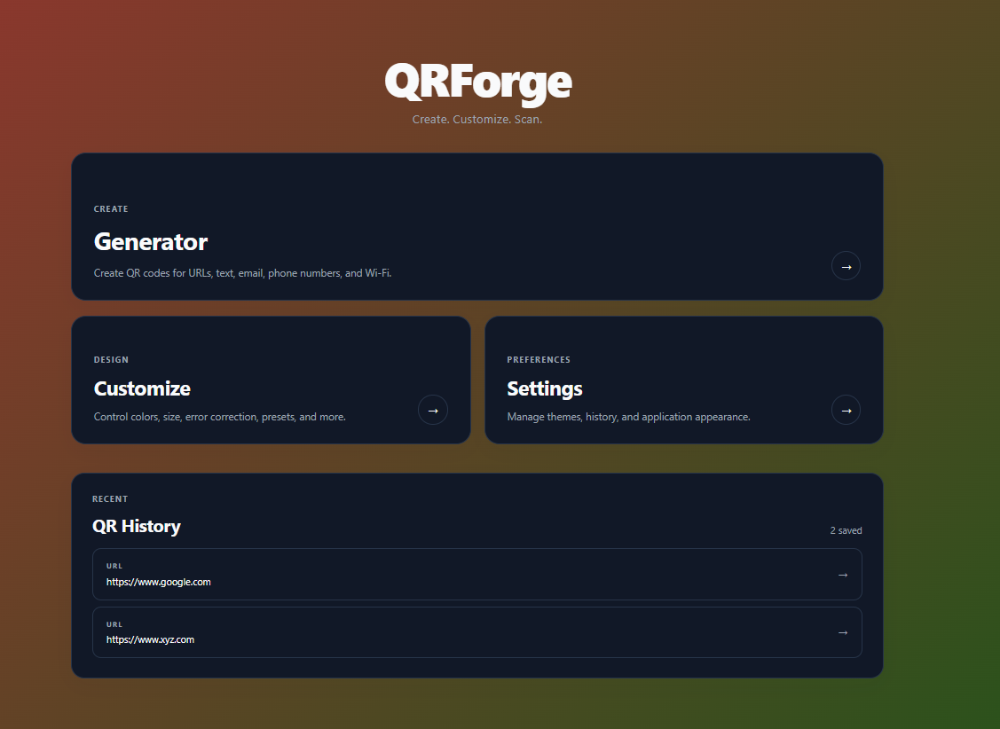
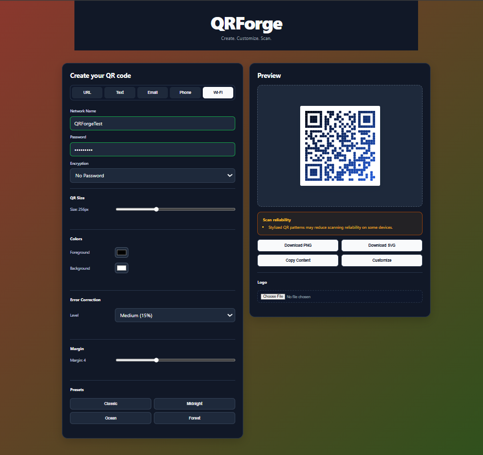

# QRForge

> Create. Customize. Scan.

QRForge is a modern browser-based QR Code Generator and Designer built with React.

It allows users to generate QR codes for multiple data types, customize their appearance in real time, export them as PNG or SVG, copy their underlying content, and store recently generated QR codes locally.

## 🚀 Live Demo

**Live Demo:** `YOUR_DEPLOYED_URL`

## 📸 Preview




---

## ✨ Features

### QR Code Generation

QRForge supports five QR code types:

- URL
- Plain Text
- Email
- Phone Number
- Wi-Fi

The QR preview updates automatically whenever the input or QR configuration changes.

### 🎨 QR Customization

Users can customize:

- QR size
- Foreground color
- Background color
- Error correction level
- Margin / quiet zone
- Visual presets
- QR gradients
- QR patterns

### 🔲 QR Patterns

QRForge supports three visual QR patterns:

- Square
- Rounded
- Dots

Finder patterns are preserved when using stylized patterns to maintain QR scanning reliability.

### 🌈 QR Gradients

Users can apply a gradient directly to the QR modules.

Available controls:

- Gradient start color
- Gradient end color

The gradient is rendered in both the live preview and SVG export.

### 🖼️ Logo Support

Users can add a custom logo to the center of a QR code.

Supported formats:

- PNG
- JPEG
- WebP

Logo uploads are limited to 2 MB.

### 📤 Export

QR codes can be exported as:

- PNG
- SVG

The exported QR reflects the current preview configuration.

### 📋 Copy Content

The generated QR payload can be copied directly to the clipboard.

### ⚠️ Scan Reliability Warnings

QRForge analyzes the current QR configuration and displays warnings when certain settings may reduce scanning reliability.

Warnings can cover:

- Small QR sizes
- Low foreground/background contrast
- Low error correction with a logo
- Stylized QR patterns
- Low-contrast gradients

### 💾 QR History

Recently downloaded QR codes can be stored locally in the browser.

History supports:

- LocalStorage persistence
- Up to 20 recent entries
- History enable/disable control
- Clear history
- Restoring saved QR configurations
- Persistence across page refreshes

### 🌓 Light & Dark Mode

QRForge supports:

- Light mode
- Dark mode

The selected theme is persisted locally.

### 🌅 Custom Application Background

Users can choose between:

- Classic background
- Custom gradient background

The gradient supports user-selected start and end colors.

---

## 🛠️ Tech Stack

| Technology | Purpose |
|---|---|
| React | User interface |
| Vite | Development and build tooling |
| JavaScript | Application logic |
| CSS | Styling and responsive design |
| React Router | Client-side navigation |
| QRCode | QR generation |
| LocalStorage | Local settings and QR history |

---

## 📁 Project Structure

```text
QRForge/
│
├── public/
│
├── src/
│   ├── context/
│   │   ├── QRContext.jsx
│   │   └── SettingsContext.jsx
│   │
│   ├── pages/
│   │   ├── Dashboard.jsx
│   │   ├── Generator.jsx
│   │   ├── Customize.jsx
│   │   └── Settings.jsx
│   │
│   ├── utils/
│   │   ├── history.js
│   │   ├── qrPayload.js
│   │   └── validation.js
│   │
│   ├── App.jsx
│   ├── App.css
│   ├── index.css
│   └── main.jsx
│
├── screenshots/
│   ├── dashboard.png
│   ├── generator.png
│   ├── customize.png
│   └── settings.png
│
├── index.html
├── package.json
├── package-lock.json
└── README.md
